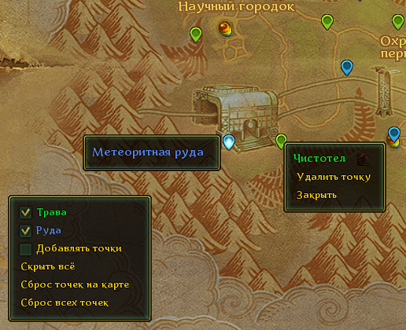

# HerbMap
_Это переработанная версия оригинального аддона за авторством [@jedbez](https://alloder.pro/profile/698-jedbez/)_

В момент сбора руды / травы  руками (или петом-помощником) текущая позиция персонажа сохраняется как точка сбора и отображается на карте: трава - зеленая метка, руда - синяя.



На главной карте отображается панель настроек:
- **Трава** - переключает видимость точек сбора травы на карте и миникарте
- **Руда** - переключает видимость точек сбора руды на карте и миникарте
- **Добавлять точки** - переключает режим добавления новых точек
- **Скрыть всё / Показать всё** - скрывает / отображает все точки на карте
- **Сброс точек на карте** - удаляет точки на текущей карте (которая в данный момент отображается на экране)
- **Сброс всех точек** - удаляет все точки, на всех картах

Одиночную точку можно удалить через контекстное меню.

Аддон настраивается через редактирование файла **config.txt**:
```lua
-- Настройки
Global("Config", {
  -- Радиус до ближайшего объекта аналогичного типа при котором координаты не будут считаться новыми
  IgnoreNewResourcesRadius = 40,
  -- Множитель размера меток на миникарте
  MiniMapPinSizeModifier = 0.8
})
```